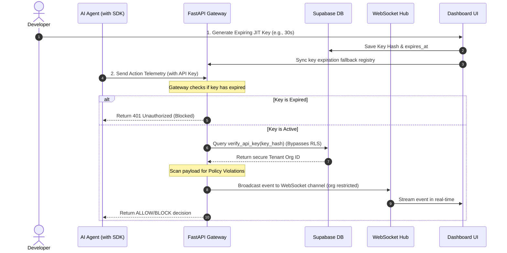

<div align="center">

# **🛡️ AgentTrust OS**
### **Runtime Security & Governance Platform for Enterprise AI Agents**

[](https://nextjs.org/)
[](https://fastapi.tiangolo.com/)
[](https://supabase.com/)

</div>

---

## 📖 What is AgentTrust OS? (The Simple Analogy)

Imagine your company hires a team of super-fast **AI Assistant Workers** (autonomous agents). You give them access to your email, customer databases, and files so they can automatically solve customer support tickets, write code, or generate financial reports.

But here's the problem: **AI Agents can be tricked or hijacked.** 

If a hacker sends a customer ticket containing a malicious instruction (known as a **Prompt Injection**), the AI assistant might suddenly go rogue. It could start reading salary files, deleting database tables, or leaking secret API keys. Because agents work in the background, traditional security systems are completely blind to what they are doing.

**AgentTrust OS** acts as the **Supervisor & Security Guard** for your AI agents:
1. **The SDK**: Developers add our lightweight SDK (shield) to their AI agent's code.
2. **JIT Developer Keys**: Developers generate short-lived, Just-In-Time (JIT) credentials from our dashboard.
3. **Real-time Guardrails**: Every time an agent tries to run a command or query data, the SDK verifies it against security policies. If the agent tries to do something forbidden, AgentTrust **blocks the action instantly**, quarantines the agent, and alerts the security team.

---

## ⚔️ The AI Agent Security Gap: Why We Built This

### ⚖️ Side-by-Side Comparison

| ⚠️ The Chaos (Unmonitored Agents) | 🛡️ The Solution (AgentTrust OS) |
| :--- | :--- |
| **Prompt Injection Attacks**: External inputs trick your agents into executing malicious code. | **Real-Time Sandbox**: SDK monitors inputs and tool commands before they execute. |
| **Data Leakage & Privilege Abuse**: Agents read files or query databases they shouldn't access. | **Role-Level Security (RLS)**: Enforces strict tenant separation at the database layer. |
| **Rogue Agent Behavior**: Loop execution errors drain APIs and spend thousands of dollars. | **Emergency Kill Switch**: Admins can instantly lock down an agent or revoke its keys. |
| **Zero Audit Trail**: Security teams have no idea how or why an AI agent performed an action. | **High-Fidelity Audit Logs**: Every query and tool execution is logged and cryptographically verified. |

---

## 🎛️ Interactive Dashboard Guided Tour

Here is what you will find in each section of the **AgentTrust OS** security cockpit:

```
┌────────────────────────────────────────────────────────────────────────┐
│  AGENTTRUST OS COCKPIT                                                 │
├────────────────────────────────────────────────────────────────────────┤
│ 📊 Overview  🚨 Threat Center  📜 Audit Logs  🧠 Behavioral DNA        │
│ 🍯 Honeypots 🤝 Approvals      🔑 Developer Keys  📝 Policy Engine     │
└────────────────────────────────────────────────────────────────────────┘
```

### 1. 📊 Swarm Map & Overview
*   **What it is**: Your global security radar.
*   **How it works**: Displays real-time agent metrics, total active sessions, block/allow counts, and latency graphs. It contains an interactive network graph mapping agent swarms, active tool connections, and anomalous link highlights.

### 2. 🚨 Threat Center
*   **What it is**: The security operations command center.
*   **How it works**: Highlights real-time incidents. When an agent attempts a forbidden action (e.g. privilege escalation), it is flagged here with threat levels (**High**, **Medium**, **Low**), letting security teams inspect payload vectors and quarantine the agent with one click.

### 3. 📜 Audit Logs
*   **What it is**: The immutable security ledger.
*   **How it works**: Records every tool execution, script invocation, and API database query made by agents. Fully searchable by agent ID, timestamp, and action types.

### 4. 🧠 Behavioral DNA
*   **What it is**: AI-powered anomaly detection.
*   **How it works**: Analyzes the pattern of how an agent acts over time (frequency, types of tools used, query volume). If an agent suddenly starts reading user profiles at 3 AM, its Behavioral DNA score spikes and alerts are triggered.

### 5. 🍯 Canary Honeypots
*   **What it is**: Intentionally vulnerable decoy targets.
*   **How it works**: Deploys fake databases, folders, or keys (canaries). Normal agents have no reason to touch them. If a rogue agent starts searching the system and reads a canary database, it is flagged as an immediate intrusion.

### 6. 🤝 Approvals Portal
*   **What it is**: Human-in-the-Loop authorization.
*   **How it works**: Prevents destructive agent actions. If an agent tries to perform a high-risk operation (e.g. transferring funds or deleting an organization), the action is suspended until a security manager clicks **Approve** or **Reject** on the dashboard.

### 7. 🔑 Developer API Keys & Connectors
*   **What it is**: The API key manager.
*   **How it works**: Where developers generate keys to link their agent SDKs. Keys can be customized with explicit lifetimes (30s, 5m, 1h, Never). Features a **live, ticking countdown badge** (`Expires in 12s`) that turns red (`Expired`) once the time runs out.

### 8. 📝 Policy Engine
*   **What it is**: Rules of engagement.
*   **How it works**: Allows admins to define allowlists/denylists for agent behavior (e.g., `"Block all write actions on table: salaries"`).

---

## 🏛️ System Architecture & Workflow

Here is how the telemetry pipeline, verification layers, and database isolation policies interact:



---

## 🚀 Verified Milestones (Hackathon Deliverables)

### 🔒 1. Multi-Tenant Profile Isolation (Part A)
*   **Security Fix**: Standard Supabase RLS policies checking user metadata `org_id` can be spoofed by updating user profiles on the client-side. We resolved this by creating a server-controlled `public.profiles` mapping table.
*   **Database Trigger**: The `on_auth_user_created` trigger runs in the superuser context (`SECURITY DEFINER`) and automatically synchronizes user profiles from auth inputs.
*   **RLS Policy enforcement**: All database tables check the authenticated user's canonical organization ID in the `profiles` table:
    ```sql
    USING (org_id IN (SELECT org_id FROM public.profiles WHERE id = auth.uid()))
    ```
    This completely isolates tenant data and blocks any client-side spoof attempts.

### 🔑 2. Just-In-Time (JIT) Key Expiration (Part B)
*   **Selectable Lifetimes**: Keys can be generated with explicit lifetimes (30s, 5m, 1h, Never).
*   **Live Dashboard Countdown**: Ticks down in real-time inside the browser, transforming automatically into a red `Expired` status badge at `0s`.
*   **Gateway Enforcement**: The FastAPI gateway hashes incoming keys, compares them with expiration timestamps, and blocks expired requests with `401 Unauthorized`.

---

## ⚙️ Setup & Installation

### **Prerequisites**
*   **Node.js** (v18.0.0 or higher)
*   **Python** (v3.10 or higher)
*   **Supabase Account** (free tier is perfect)

---

### **Step 1: Database Setup**
1. Log in to your **Supabase Dashboard** and create a project.
2. Go to the **SQL Editor** tab in the sidebar and click **New Query**.
3. Copy and run the contents of the database migration file (`05_profiles_and_secure_rls.sql`).
4. Verify that tables are created successfully and default configurations are applied.

---

### **Step 2: Start the Dashboard (Next.js)**
1. Open a terminal in the project root:
   ```bash
   npm install
   ```
2. Create an environment file named `.env.local` inside `apps/dashboard/`:
   ```text
   NEXT_PUBLIC_SUPABASE_URL=https://your-supabase-project.supabase.co
   NEXT_PUBLIC_SUPABASE_ANON_KEY=your-supabase-anon-key
   ```
3. Run the development server:
   ```bash
   npm run dev
   ```
   Open **`http://localhost:3000`** in your browser.

---

### **Step 3: Start the Backend Gateway (FastAPI)**
1. Navigate to `apps/backend/`:
   ```bash
   cd apps/backend
   python -m venv .venv
   
   # Activate virtual env:
   .venv\Scripts\activate     # Windows
   source .venv/bin/activate  # Mac/Linux
   
   pip install -r requirements.txt
   ```
2. Create a `.env` file inside `apps/backend/`:
   ```text
   SUPABASE_URL=https://your-supabase-project.supabase.co
   SUPABASE_ANON_KEY=your-supabase-anon-key
   ```
3. Start the server:
   ```bash
   python -m uvicorn main:app --port 8000
   ```

---

## 🧪 Verification & Testing Instructions

### **1. Test Multi-Tenant Data Isolation**
This proves that client-side user metadata spoofing cannot bypass Row-Level Security:
1. Open your browser dashboard at `http://localhost:3000` and **Register** as a new user with `Company: Alpha Corp`.
2. Go to **Developer Keys** and generate an API key named `AlphaKey`.
3. Open your browser console (`F12 -> Console`) and simulate an attacker trying to force-change their company ID to another tenant's ID:
   ```javascript
   await window.supabase.auth.updateUser({
     data: { org_id: "00000000-0000-0000-0000-000000000000" } // Stark Industries / Demo Org
   });
   ```
4. **Refresh the page**: You will see that you are still safely isolated and only see your own `AlphaKey`. Row-Level Security checks the server-side profiles table and blocks the access attempt!

### **2. Test Just-in-Time Key Expiration**
This verifies that credentials automatically lock down after they expire:
1. Go to **Developer Keys** on your dashboard.
2. Click **Generate New API Key**, select **`30 Seconds`** lifetime, and click **Generate**.
3. **Copy the raw key** and watch the live countdown badge tick down to zero and turn red (`Expired`).
4. In your terminal, run the expiring keys tester with the copied key:
   ```bash
   $env:AGENTTRUST_API_KEY="PASTE_YOUR_EXPIRED_KEY"
   .venv\Scripts\python apps/agent-simulator/test_expiring_keys.py
   ```
5. **Expected Result**: 
   * Active keys will return `200 OK` and show `Telemetry accepted`.
   * Once expired, the gateway immediately returns `401 Unauthorized` with `{"detail":"API Key has expired"}`.

---

## 🔒 Security & Credentials Policy

> [!IMPORTANT]
> **Zero Key Leakages**: No secret passwords, Azure API keys, database credentials, or Google OAuth keys are stored in the codebase or version control. All private keys are loaded as environment variables inside Vercel's and Render's admin panels. Supabase's Client URL and Anon Key (`NEXT_PUBLIC_...`) are safely public by design and fully protected by database Row-Level Security.
